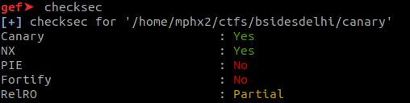
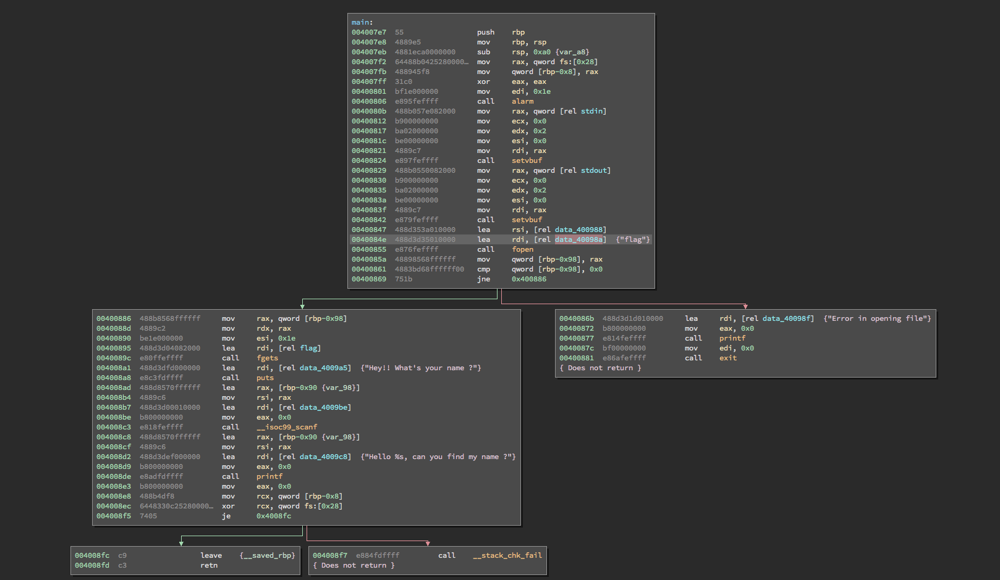
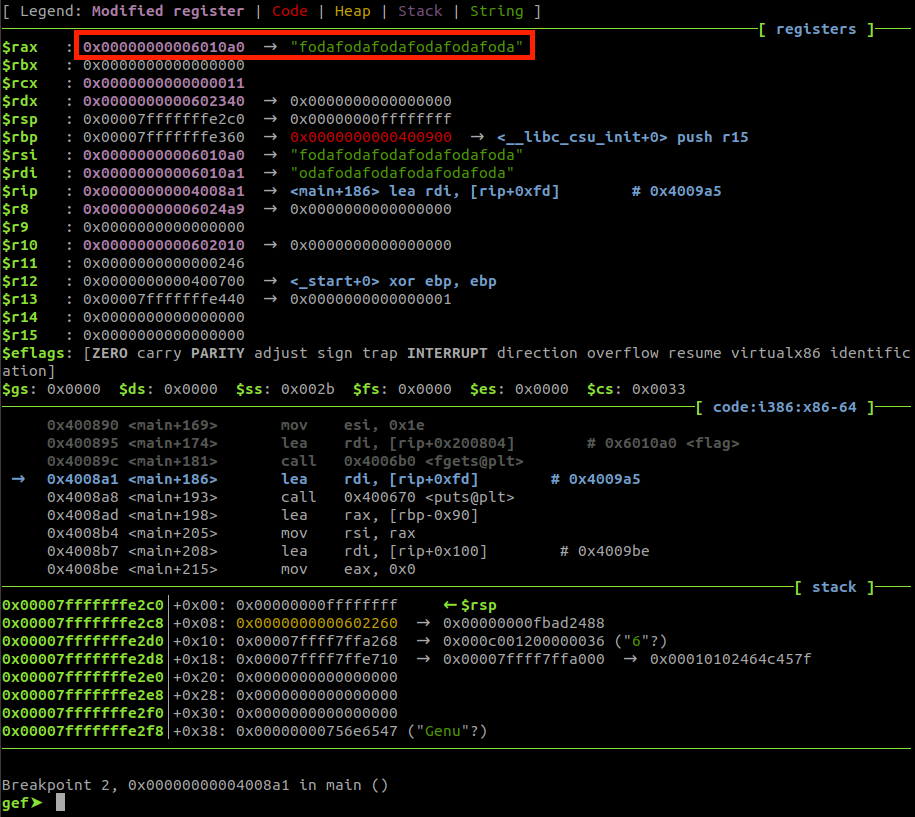

A x64 binary:

canary: ELF 64-bit LSB executable, x86-64, version 1 (SYSV), dynamically linked, interpreter /lib64/ld-linux-x86-64.so.2, for GNU/Linux 3.2.0, BuildID[sha1]=2bd9b7e48adf0e9807bc2f3418d030acdcc8cdb6, not stripped

As the name of the challenge implies, there is Canary and also NX enabled on the file.

The application is pretty simple. 

It starts opening the flag file (flag) and copying the contents to the static address 0x6010a0.

And then the binary asks for your name and use the vulnerable function scanf() for the users' input. There's not a simple way for using this stack-based buffer overflow for executing arbitrary functions since there is the canary protection and no obvious way to leak due the lack of functions on the application.

However, it is possible to abuse th evulnerability overwriting the argv[0] with the flag's content address (0x6010a0) and on the exception message from the libc, the flag will be leaked.
