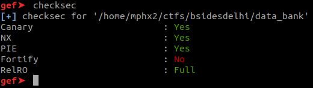
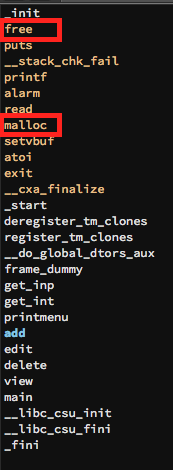
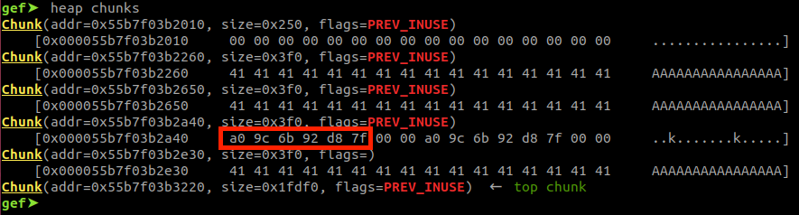
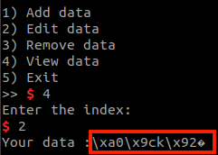
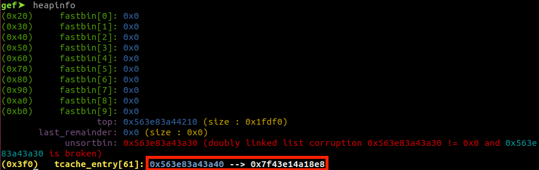
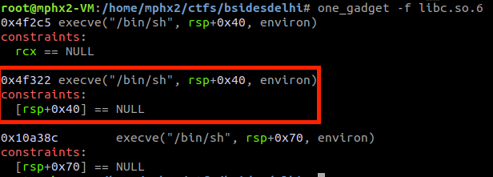
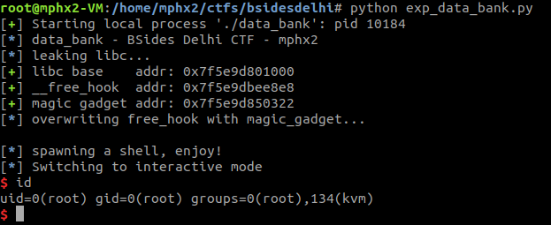

A x64 binary file:

data_bank: ELF 64-bit LSB shared object, x86-64, version 1 (SYSV), dynamically linked, interpreter /lib64/ld-linux-x86-64.so.2, for GNU/Linux 3.2.0, BuildID[sha1]=9fce7c0551b4394096ca7820417815132c8f029c, not stripped

The binary is almost fully protected, only missing Fortify:

So it is not possible to use gadgets without leaking due to the PIE and neither overwrite the GOT entries because of the Full RelRo.

Disassembling the binary it can be noted not many functions but malloc() and free() which indicates that could be a heap exploitation challenge.

Utilizing a double-free vulnerability it is possible to corrupt a chunk and leak a libc address after freeing it 8 times that already poisons the tcache.

Now we can use the view() function to leak the libc address from the chunk.

For the exploitation, it is possible to use the tcache poisoning attack and overwrite __free_hook() with the magic gadget using the edit() function on the corrupted chunk.

It was provided a libc, so the libc base address, magic gadget and the __free_hook() addresses can be calculated.

root@mphx2-VM:/home/mphx2/ctfs/bsidesdelhi# readelf -s libc.so.6 | grep free_hook
   221: 00000000003ed8e8     8 OBJECT  WEAK   DEFAULT   35 __free_hook@@GLIBC_2.2.5

Ultimately use delete() function to trigger free(), the overwritten __free_hook() and the shell pops up.

