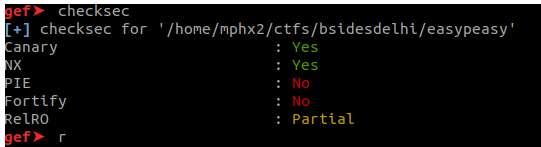
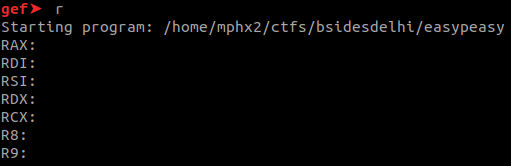
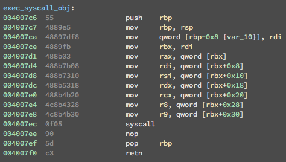

A x64 binary file:

easypeasy: ELF 64-bit LSB executable, x86-64, version 1 (SYSV), dynamically linked, interpreter /lib64/ld-linux-x86-64.so.2, 
for GNU/Linux 2.6.32, BuildID[sha1]=174509cedf6f9aa8ba5dca623f0a3ac6c32ee558, not stripped

The binary asks for 7 values for the registers in loop: 

These registers are used to be executed by the syscall implemented on exec_syscall_obj(). As seen on the screenshot below:

