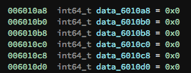

A x64 binary file:

**easypeasy: ELF 64-bit LSB executable, x86-64, version 1 (SYSV), dynamically linked, interpreter /lib64/ld-linux-x86-64.so.2, 
for GNU/Linux 2.6.32, BuildID[sha1]=174509cedf6f9aa8ba5dca623f0a3ac6c32ee558, not stripped**

The binary asks for 7 values for the registers in loop: 

These registers are used to be executed by the syscall implemented on exec_syscall_obj(). 

However, only few syscalls are available, those are been filtered by the function validate_syscall_obj().
Only, **open(0x2)/read(0x0)/write(0x1)/close(0x3)/exit(0x3c)**.

Now it is needed to set the values to open/read/write the flag from the file /home/easypeasy/flag, indicated on the challenge description.

Since there is no PIE, we can write data on the file and re-utilize for our execution. The application is saving each data 
from the registers on .data.

To be able to write the full path (/////home/easypeasy/flag) it was used three registers RCX, R8 and R9 for this matter since it won't be utilized for this exploitation. The address **0x601500** (.data) was used for saving the data from the flag file.

