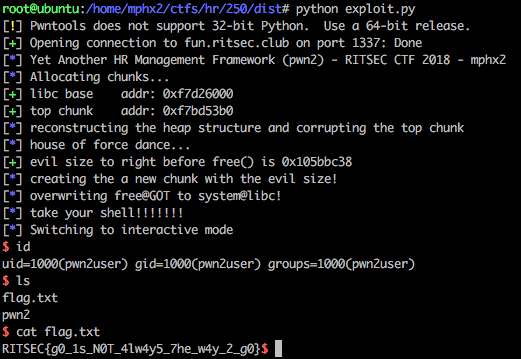

A x32 ELF file:

**pwn2: ELF 32-bit LSB executable, Intel 80386, version 1 (SYSV), dynamically linked, interpreter /lib/ld-linux.so.2, for GNU/Linux 2.6.32, BuildID[sha1]=8683cf78a615c5820aef885b4612b71806a77b00, not stripped**

The binary protections:

gef➤  checksec

[+] checksec for '/home/mphx2/ctfs/hr/250/dist/pwn2'

Canary                        : Yes

NX                            : Yes

PIE                           : No

Fortify                       : Yes

RelRO                         : Partial

gef➤

The application is developed in GO, so the static analysis is a little bit tricky.

The binary has five options create/edit/print/delete a person and exit.

Full write-up later.

