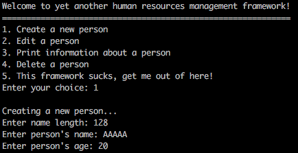
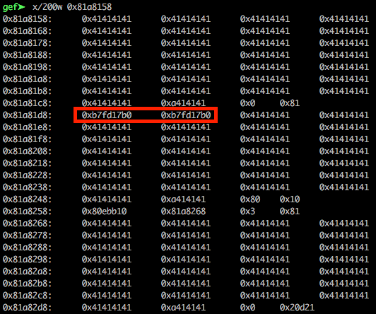
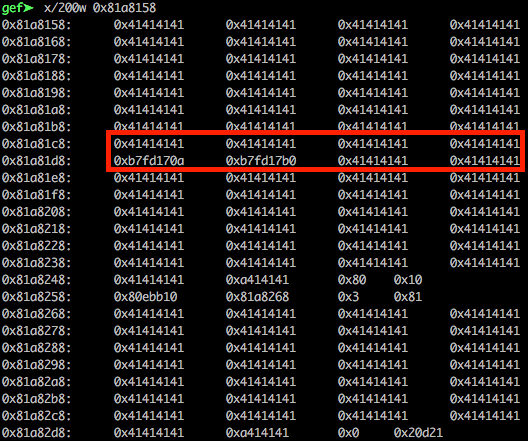
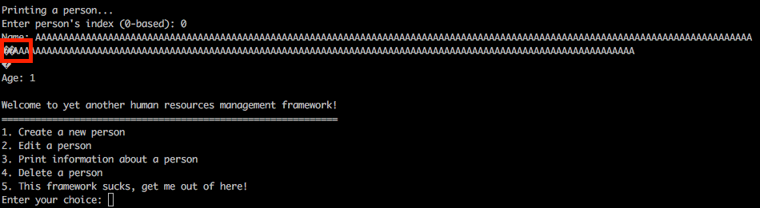
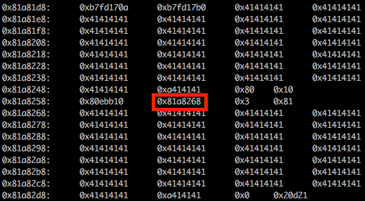

A x32 ELF file:

**pwn2: ELF 32-bit LSB executable, Intel 80386, version 1 (SYSV), dynamically linked, interpreter /lib/ld-linux.so.2, for GNU/Linux 2.6.32, BuildID[sha1]=8683cf78a615c5820aef885b4612b71806a77b00, not stripped**

The binary protections:

gef➤  checksec

[+] checksec for '/home/mphx2/ctfs/hr/250/dist/pwn2'

Canary                        : Yes

NX                            : Yes

PIE                           : No

Fortify                       : Yes

RelRO                         : Partial

gef➤

The application is developed in GO, so the static analysis is a little bit tricky.

The binary has five options create/edit/print/delete a person and exit. There are no boundries on the application, it is possible to overflow any chunk (heap overflow), edit deleted chunks (UAF), etc. 

For leaking the libc, it was created three chunks, deleted the second one and edited the first chunk with bytes overwriting until the libc addresses on the second chunk.

At this point, it was deleted the second chunk (ID=1):

Now the first chunk (ID=0) is edited to overwrite all the null chars to the libc addresses. In this case the original first chunk was 120 bytes and now will be 129 bytes (one extra for \x0a) and filled with 128 bytes.

Printing the first chunk and leaking the libc address:

It's important to restore the chunks structure as the same it was when deleted the second chunk. Editing the first chunk and setting the bytes as they were.

"A"*120+p32(0x0)+p32(0x91)

Now, it's used the same technique to leak the heap address on the third chunk, overflowing the second chunk.

At this point, we have all addresses needed for an attack. In this case, I utilized the "House of Force" technique, where the top chunk is corrupted to a negative number allowing to create a big chunk without calling mmap() that will overlap until the address set to overwrite.

While reconstructing the state from the chunks using the first chunk with 457 bytes, it was set the top chunk as **0xffffffff**. And it also includes the future argument for system() after free@GOT gets overwritten.

"A"*120+p32(0x0)+p32(0x91)+"E"*140+p32(0x11)+p32(bin_sh)*2+p32(0x0)+p32(0xa9)+"F"*160+p32(0x0)+p32(0xffffffff)

To calculate the size that will be necessary to reach the wanted function, in this case free@GOT:

size = free_got_addr - 0x30 (3 (chunks) * 0x10 (header size)) - top_chunk_addr

Now it needs to be created a chunk with this size and then the next chunk created will overwrite the address defined (free@GOT) and it is possible to set any value, in this case, system@libc.

To calculate system(), it's used the libc base (calculated from the leak) + 0x3a940. Offset defined by the provided libc file.

$ readelf -s libc.so.6 | grep system

   245: 00110840    68 FUNC    GLOBAL DEFAULT   13 svcerr_systemerr@@GLIBC_2.0
   
   627: 0003a940    55 FUNC    GLOBAL DEFAULT   13 __libc_system@@GLIBC_PRIVATE
   
  1457: 0003a940    55 FUNC    WEAK   DEFAULT   13 system@@GLIBC_2.0

After done, use the delete person option on the third chunk (ID=2) to call the overwritten free and get a shell.

Reviewing:

- Leak libc and heap addresses.
- Calculate offset to system() and top chunk.
- Reconstruct the chunks' state and corrupt top chunk.
- Calculate size necessary for overwriting free@GOT.
- Create a chunk with this size.
- Create another chunk that will overwrite free@GOT, with system() as data.
- Delete the chunk ID=2 (third) to trigger free => system.

Link to the exploit 
