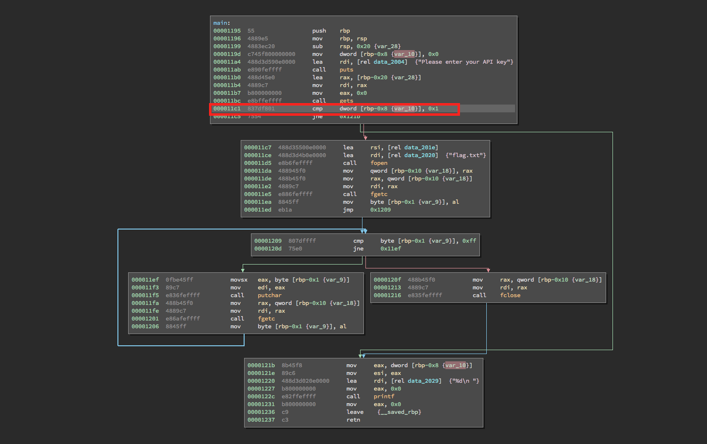
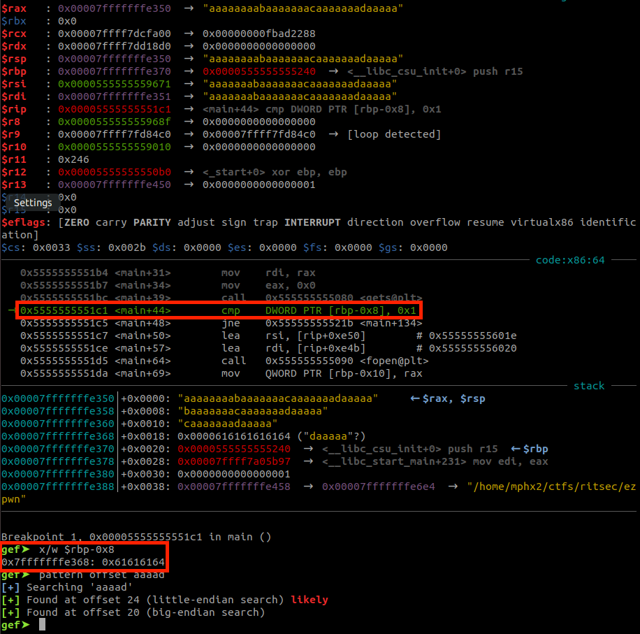
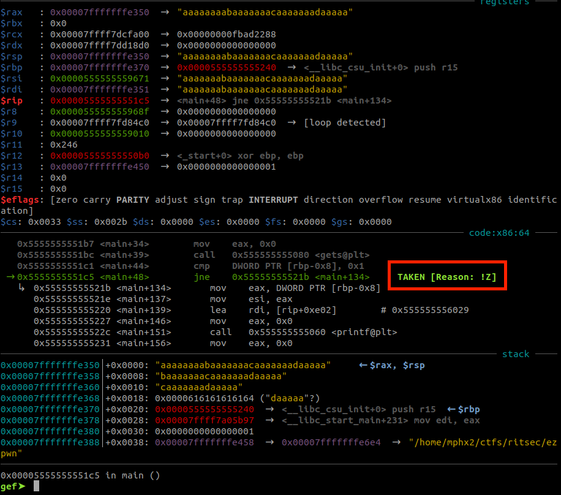
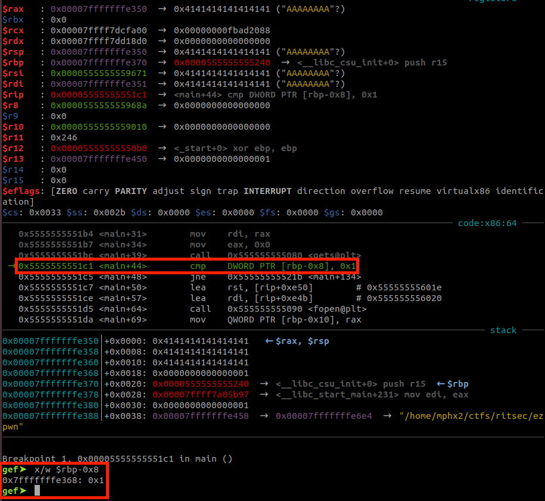
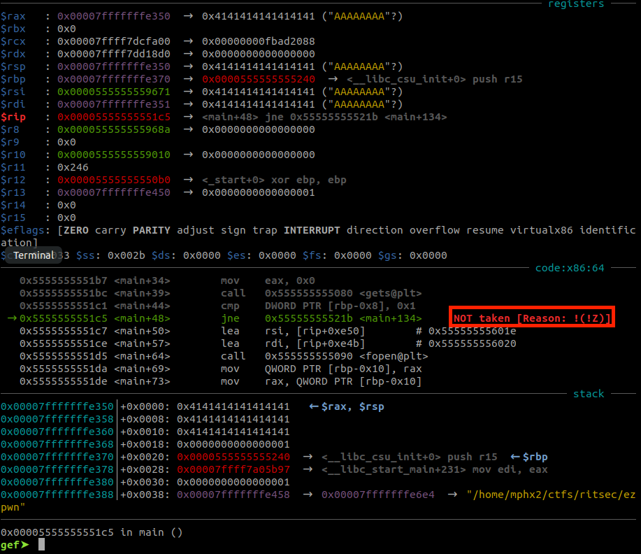

A x64 ELF file:

**ezpwn: ELF 64-bit LSB shared object, x86-64, version 1 (SYSV), dynamically linked, interpreter /lib64/ld-linux-x86-64.so.2, for GNU/Linux 3.2.0, BuildID[sha1]=70db9c478cbba53ebfb9c27c175bb06d894331ec, not stripped**

Binary protections:

gef➤  checksec

[+] checksec for '/home/mphx2/ctfs/ritsec/ezpwn'

Canary                        : No

NX                            : Yes

PIE                           : Yes

Fortify                       : No

RelRO                         : Partial

gef➤ 

This is a pretty simple application:

At the address 0x11c1, if RBP-0x8 is equal to 0x1, the application will open the flag file (flag.txt) and will print along with the decimal value from RBP-0x8 (address 0x122c).

So using the function gets() -- 0x11bc, it is possible to overwrite this position.

Continuing the execution flow with an arbitrary value for RBP-0x8.

At this case, after 24 bytes it was overwritten RBP-0x8's value. And setting this byte as 0x1 we can take the execution path where the flag is being printed.

Executing locally it was used 24 bytes as offset to RBP-0x8, however for the remote host, it was need an adjustment that was possible to identify due to the character printed in decimal.

